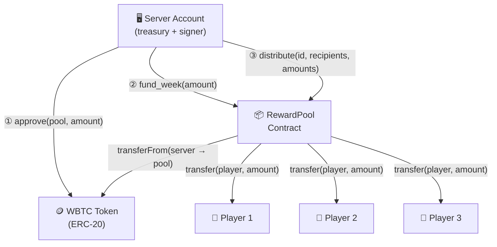
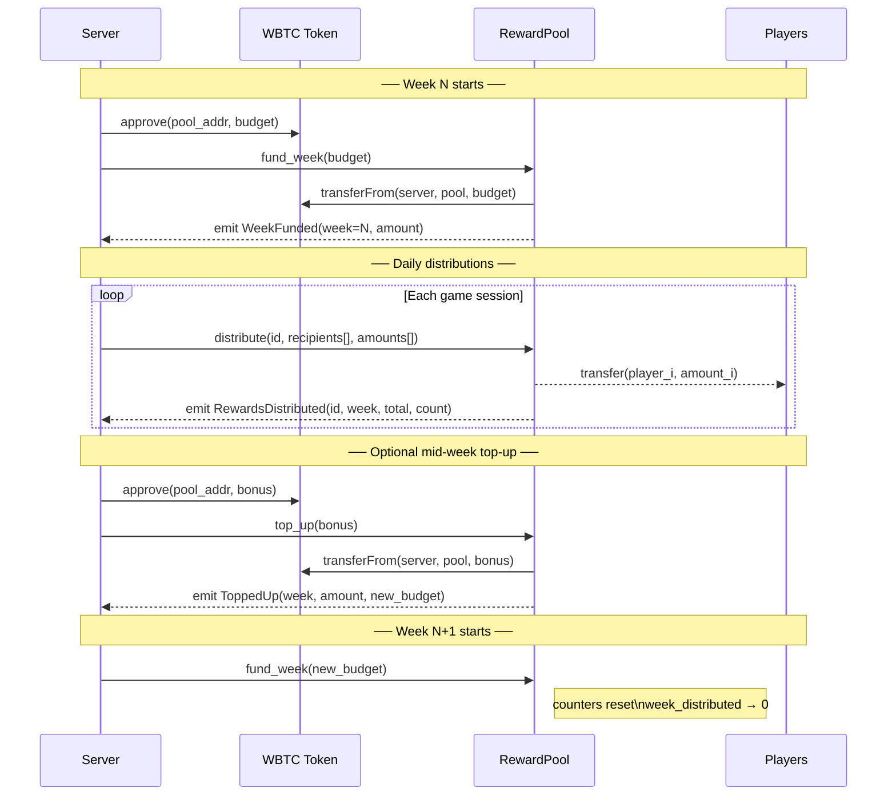
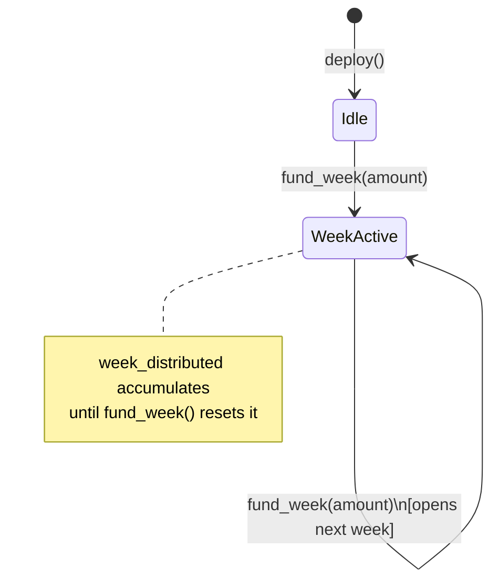
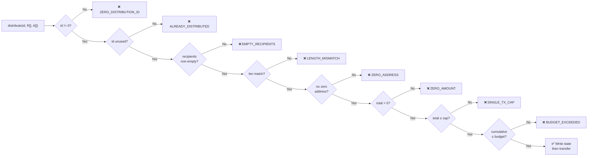
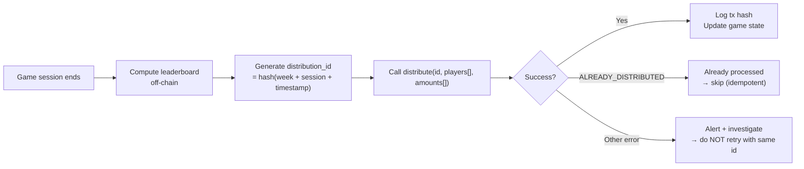

# RewardPool

> Automated weekly reward distribution contract for the **Escape Saylor** leaderboard — built in Cairo on Starknet.

[](https://www.cairo-lang.org/)
[](https://github.com/OpenZeppelin/cairo-contracts)
[](https://github.com/foundry-rs/starknet-foundry)
[](#testing)
[](LICENSE)

---

## Overview

`RewardPool` is a single-owner contract that holds a weekly WBTC budget and distributes it to players in batch. The server account is the sole operator — it funds each new week, optionally tops up the pool mid-week, and fires distribution calls after each game session.

Key properties:
- **Non-custodial for players** — tokens are pushed directly to player wallets, never held on their behalf
- **Idempotent distributions** — every batch carries a unique `distribution_id`; replays are rejected on-chain
- **Capped exposure** — a configurable basis-point cap limits the maximum tokens that can leave the pool in a single transaction
- **CEI-compliant** — all state mutations happen before external calls, eliminating reentrancy risk

---

## Architecture

### System overview



### Weekly lifecycle



### Contract state machine



---

## Security model

### Safety caps

Every `distribute()` call is subject to **two independent guards** that both must pass:

```
single-tx cap  =  weekly_budget × max_distribution_bps / 10_000
```

| Guard | Protects against |
|-------|-----------------|
| **Single-tx cap** (default 15%) | Compromise of the server key mid-week: limits blast radius to 15% of budget per call |
| **Weekly budget cap** | Cumulative overspend across multiple distributions in the same week |



### CEI pattern

State is always mutated **before** external calls:

```
1. processed_distributions[id] = true    ← idempotency lock
2. week_distributed += total             ← budget accounting
3. total_distributed += total            ← global accounting
4. token.transfer(player_i, amount_i)    ← external calls (last)
```

### Input validation matrix

| Parameter | Check | Error |
|-----------|-------|-------|
| `owner` (constructor) | `!= address(0)` | `ZERO_ADDRESS` |
| `token` (constructor) | `!= address(0)` | `ZERO_ADDRESS` |
| `amount` (fund_week / top_up) | `> 0` | `ZERO_AMOUNT` |
| `distribution_id` | `!= 0` | `ZERO_DISTRIBUTION_ID` |
| `recipients.len()` | `> 0` | `EMPTY_RECIPIENTS` |
| `recipients.len() == amounts.len()` | equal | `LENGTH_MISMATCH` |
| `recipients[i]` | `!= address(0)` | `ZERO_ADDRESS` |
| `sum(amounts)` | `> 0` | `ZERO_AMOUNT` |
| `sum(amounts)` | `<= cap` | `SINGLE_TX_CAP` |
| `cumulative + sum` | `<= weekly_budget` | `BUDGET_EXCEEDED` |
| `bps` (set_max_bps) | `<= 10_000` | `INVALID_BPS` |

---

## Contract API

### Write functions (owner only)

#### `fund_week(amount: u256)`
Opens a new week. Pulls `amount` WBTC from the caller via `transferFrom`, increments `current_week`, and resets `week_distributed` to zero.

> Caller must have previously called `WBTC.approve(pool_address, amount)`.

#### `top_up(amount: u256)`
Adds `amount` to the current week's budget without resetting `week_distributed`. Useful for adding bonus prizes mid-week.

#### `distribute(distribution_id: felt252, recipients: Array<ContractAddress>, amounts: Array<u256>)`
Batch-transfers WBTC to `recipients[i]` with `amounts[i]`. The `distribution_id` must be globally unique — any replay is rejected.

#### `set_max_distribution_bps(bps: u16)`
Updates the single-tx cap. `bps` is expressed in basis points (1 bps = 0.01%). Setting to `0` effectively pauses distributions. Must be `<= 10_000`.

### Read functions (public)

#### `get_stats() → WeekStats`
```
WeekStats {
    current_week:      u64,   // week counter (starts at 1 after first fund_week)
    weekly_budget:     u256,  // tokens available this week
    week_distributed:  u256,  // tokens sent out this week
    total_distributed: u256,  // all-time tokens distributed
    remaining:         u256,  // weekly_budget - week_distributed
}
```

#### `get_remaining() → u256`
Shorthand for `weekly_budget - week_distributed`.

#### `get_token() → ContractAddress`
Returns the WBTC token address.

#### `is_distributed(distribution_id: felt252) → bool`
Returns `true` if this `distribution_id` has already been processed.

### Events

| Event | Emitted by | Fields |
|-------|-----------|--------|
| `Initialized` | constructor | `owner`, `token`, `max_distribution_bps` |
| `WeekFunded` | `fund_week` | `week`, `amount` |
| `ToppedUp` | `top_up` | `week`, `amount`, `new_budget` |
| `RewardsDistributed` | `distribute` | `distribution_id`, `week`, `total_amount`, `recipient_count` |
| `MaxDistributionBpsUpdated` | `set_max_distribution_bps` | `old_bps`, `new_bps` |
| `OwnershipTransferred` | OwnableComponent | `previous_owner`, `new_owner` |

---

## Storage layout

```
slot  key                        type
────  ─────────────────────────  ────────────────────────────────
 0    ownable.owner              ContractAddress
 1    token                      ContractAddress
 2    current_week               u64
 3    weekly_budget              u256  (2 slots)
 5    week_distributed           u256  (2 slots)
 7    total_distributed          u256  (2 slots)
 9    max_distribution_bps       u16
 *    processed_distributions    Map<felt252, bool>  (hash-addressed)
```

---

## Getting started

### Prerequisites

```bash
# Scarb (Cairo package manager + build tool)
curl --proto '=https' --tlsv1.2 -sSf https://docs.swmansion.com/scarb/install.sh | sh

# Starknet Foundry (test runner + deployment CLI)
curl -L https://raw.githubusercontent.com/foundry-rs/starknet-foundry/master/scripts/install.sh | sh
snfoundryup
```

Verify:
```bash
scarb --version   # >= 2.11.2
snforge --version # >= 0.51.2
sncast --version  # >= 0.51.2
```

### Build

```bash
scarb build
```

Artifacts are written to `target/dev/`:
- `reward_pool_RewardPool.contract_class.json` — Sierra
- `reward_pool_RewardPool.compiled_contract_class.json` — CASM

### Testing

```bash
snforge test
```

Expected output:
```
Tests: 30 passed, 0 failed, 0 ignored, 0 filtered out
```

Run a specific test:
```bash
snforge test test_distribute_success
```

Run a group:
```bash
snforge test test_distribute
```

#### Test coverage breakdown

| Category | Tests |
|----------|-------|
| Deployment & initial state | 1 |
| `fund_week` | 4 |
| `top_up` | 3 |
| `distribute` — happy path | 3 |
| `distribute` — access & validation | 5 |
| `distribute` — budget & cap guards | 4 |
| `distribute` — zero-address / zero-id | 3 |
| `set_max_distribution_bps` | 3 |
| View consistency | 2 |
| Integration (full week cycle) | 1 |
| Edge cases (zero amounts, skipping) | 1 |
| **Total** | **30** |

---

## Deployment

### Sepolia (testnet)

```bash
# Deploys a MockERC20 automatically if WBTC_ADDRESS is not set
OWNER=0x<your_server_account> ./scripts/deploy.sh
```

### Mainnet

```bash
NETWORK=mainnet \
OWNER=0x<your_server_account> \
WBTC_ADDRESS=0x<wbtc_on_starknet> \
./scripts/deploy.sh
```

The script will:
1. Build the contracts with `scarb build`
2. Deploy `MockERC20` on testnet (skipped on mainnet)
3. Declare the `RewardPool` class
4. Deploy the `RewardPool` instance
5. Save deployment info to `deployments/<network>.json`

### Post-deployment checklist

```bash
# 1. Verify deployment info
cat deployments/sepolia.json

# 2. Approve the pool to spend WBTC from the server account
sncast --profile sepolia invoke \
  --contract-address $WBTC_ADDRESS \
  --function approve \
  --calldata $POOL_ADDRESS <AMOUNT_LOW> <AMOUNT_HIGH>

# 3. Fund the first week
sncast --profile sepolia invoke \
  --contract-address $POOL_ADDRESS \
  --function fund_week \
  --calldata <AMOUNT_LOW> <AMOUNT_HIGH>

# 4. Verify state
./scripts/ops.sh stats
```

---

## Operations runbook

### Daily distribution flow



### Common operations

```bash
# Check current pool state
./scripts/ops.sh stats

# Fund a new week (0.5 WBTC = 50_000_000 satoshis)
./scripts/ops.sh fund-week 50000000

# Add bonus mid-week (0.1 WBTC)
./scripts/ops.sh top-up 10000000

# Check if a distribution was already processed
./scripts/ops.sh is-distributed 0x<distribution_id_as_felt>
```

### Incident response

| Scenario | Action |
|----------|--------|
| Server key compromised | Transfer ownership immediately via `OwnableComponent.transfer_ownership()` |
| Suspicious distribution attempt | Set `max_distribution_bps` to `0` to pause all distributions |
| Wrong amount distributed | Cannot reverse on-chain — investigate off-chain, adjust next distribution |
| Distribution reverted mid-batch | Entire tx rolled back; retry with same `distribution_id` is safe |

---

## Dependencies

| Package | Version | Purpose |
|---------|---------|---------|
| `starknet` | `>=2.11.0` | Core Starknet primitives |
| `openzeppelin_token` | `v3.0.0` | ERC-20 component |
| `openzeppelin_access` | `v3.0.0` | `OwnableComponent` |
| `openzeppelin_interfaces` | `v3.0.0` | `IERC20` dispatcher |
| `snforge_std` | `0.51.2` | Test utilities (dev) |
| `openzeppelin_testing` | `v3.0.0` | OZ test helpers (dev) |

---

## Project structure

```
escape-saylor-contracts/
├── src/
│   ├── lib.cairo              # Crate root
│   ├── interfaces.cairo       # IRewardPool trait + WeekStats struct
│   ├── reward_pool.cairo      # Contract implementation
│   ├── tests.cairo            # Test module root
│   └── tests/
│       ├── mock_erc20.cairo   # Minimal ERC-20 test double
│       └── test_reward_pool.cairo  # 30 tests
├── scripts/
│   ├── deploy.sh              # Declare + deploy (Sepolia / Mainnet)
│   └── ops.sh                 # Runtime operations helper
├── Scarb.toml                 # Package manifest
├── Scarb.lock                 # Locked dependency tree
└── snfoundry.toml             # Starknet Foundry profiles
```

---

## License

MIT — see [LICENSE](LICENSE).
